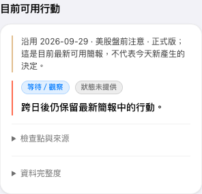
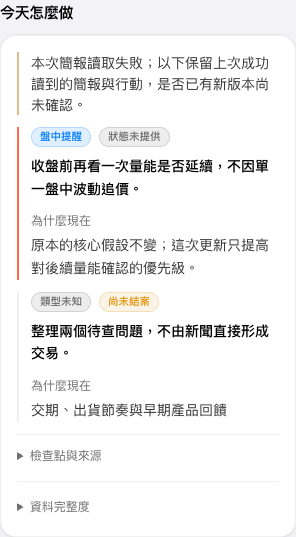

# Issue #67 rendered evidence

These screenshots use synthetic fixtures only; they contain no personal or live account data. The implementation was rendered at code revision `4ca93e1f40a2a2b5ed4b557d4c22d68b626622fd`. This evidence-only commit adds the captures and this note; application code is unchanged.

## Latest available brief after a date boundary

Expected: retain the 2026-09-29 formal brief and its action row, label it as the latest available snapshot, and do not imply it is a new decision for 2026-09-30.

## Failed refresh with a last-good snapshot

Expected: clearly disclose that the current read failed and a newer version could not be confirmed, while retaining the last successful brief and its action rows.

